# Persiapan
membuat lab5_javascript.html

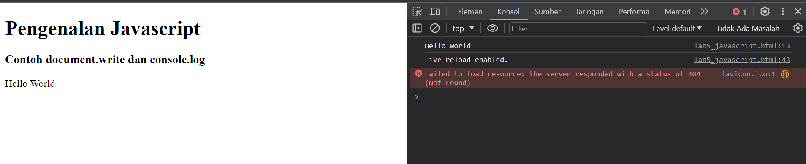

### Javascript  dasar
1. pemakaian alert sebagai properti window
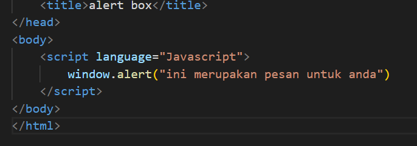
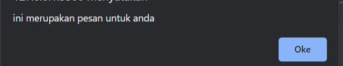

2. pemakaian method dalam objek

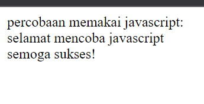

3. prompt

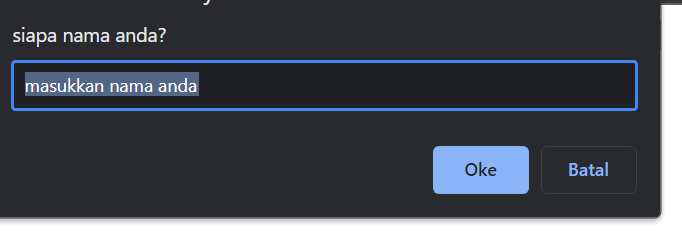
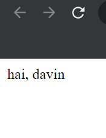

4. fungsi
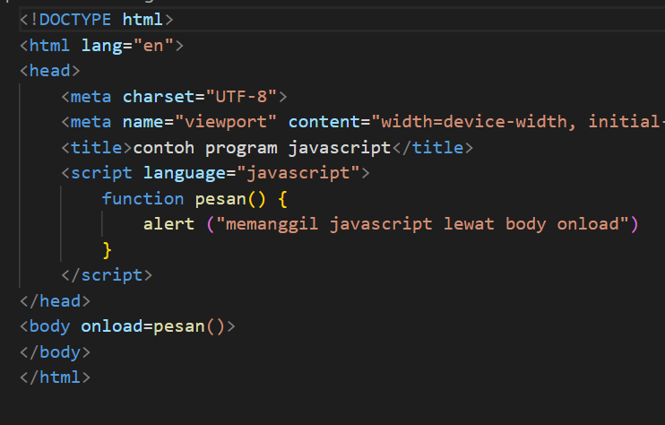
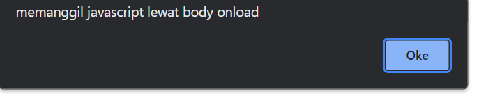

### dasar pemrograman di javascript
1. aritmatika
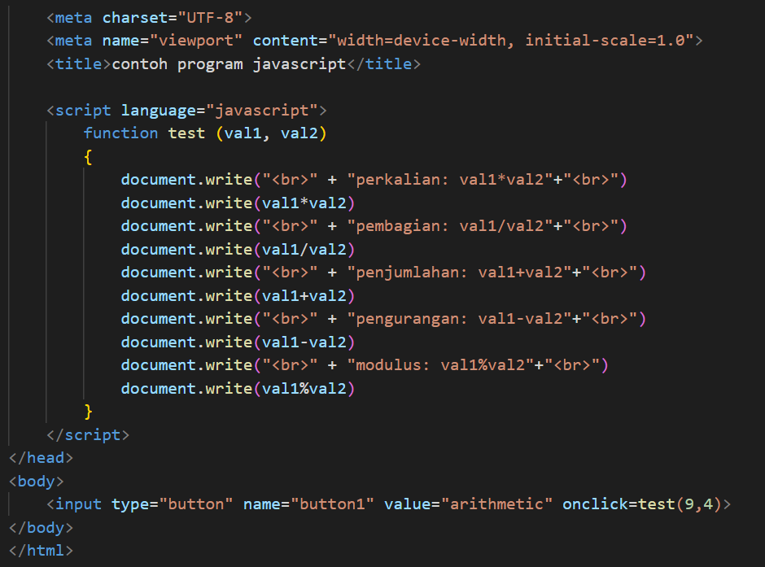
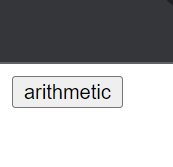
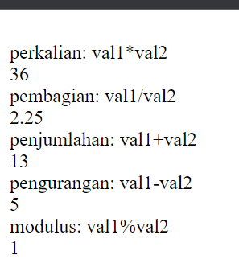

2. if else
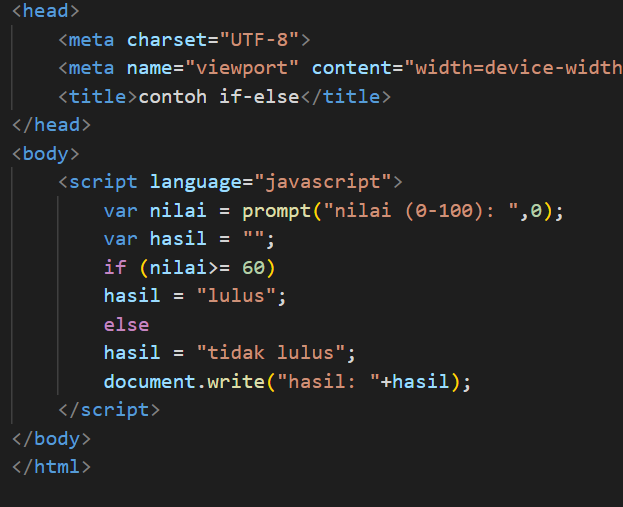
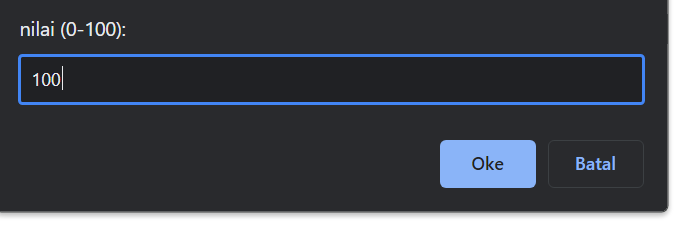
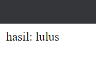

3. switch
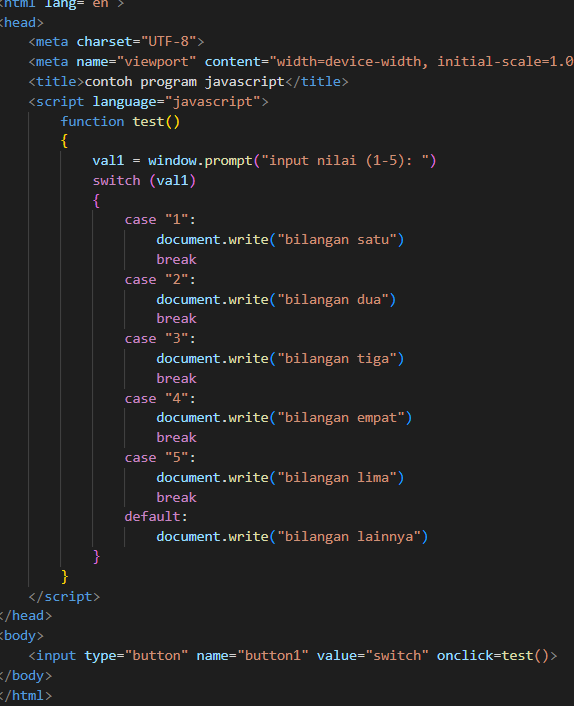

- jika diisi
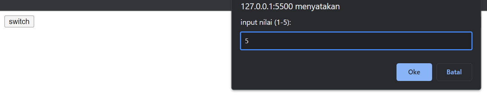
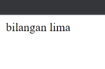

- jika tidak diisi
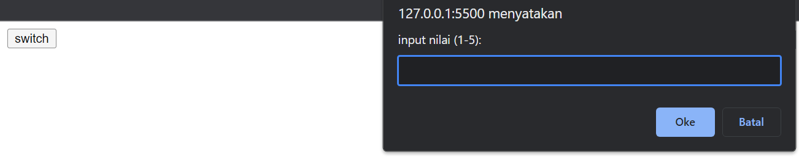
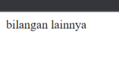

### Pembuataan form
1. form input
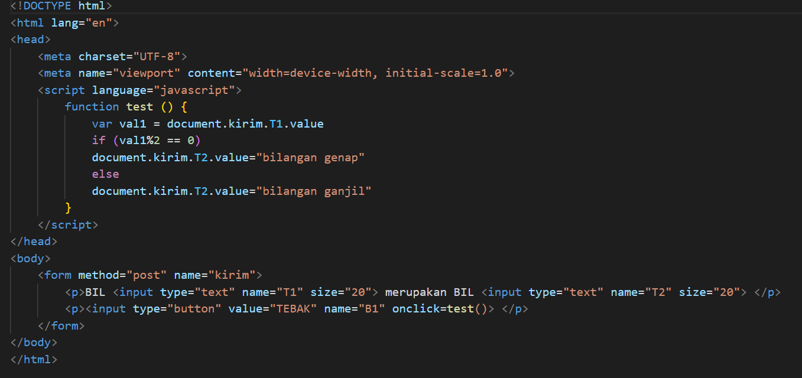

2. form button
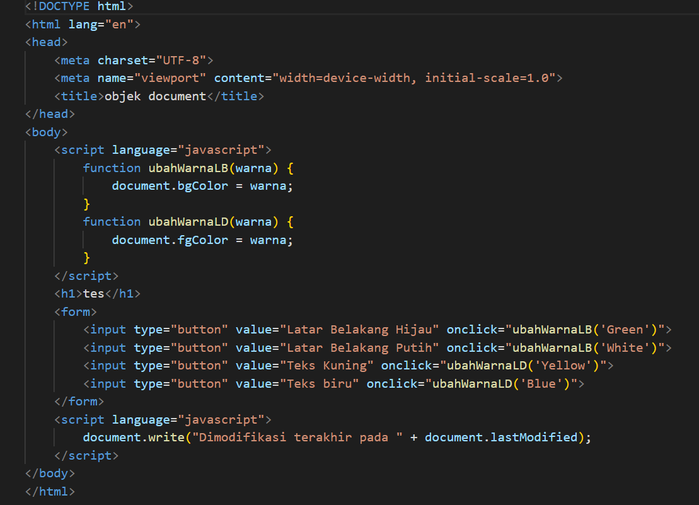

- klik latar belakang hijau
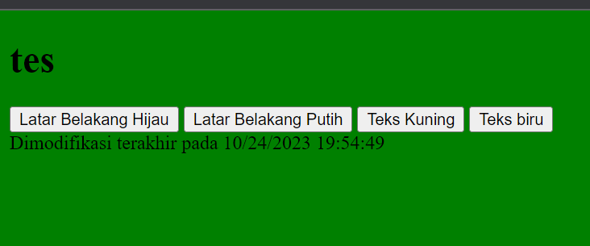

- klik latar belakang putih
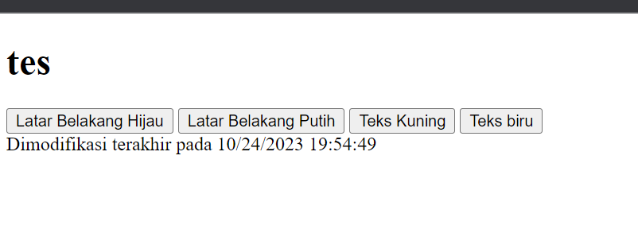

- klik teks kuning
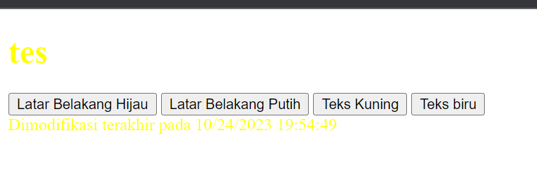

- klik teks biru
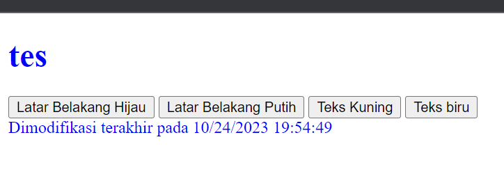

### HTML DOM
1. menggunakan checkbox
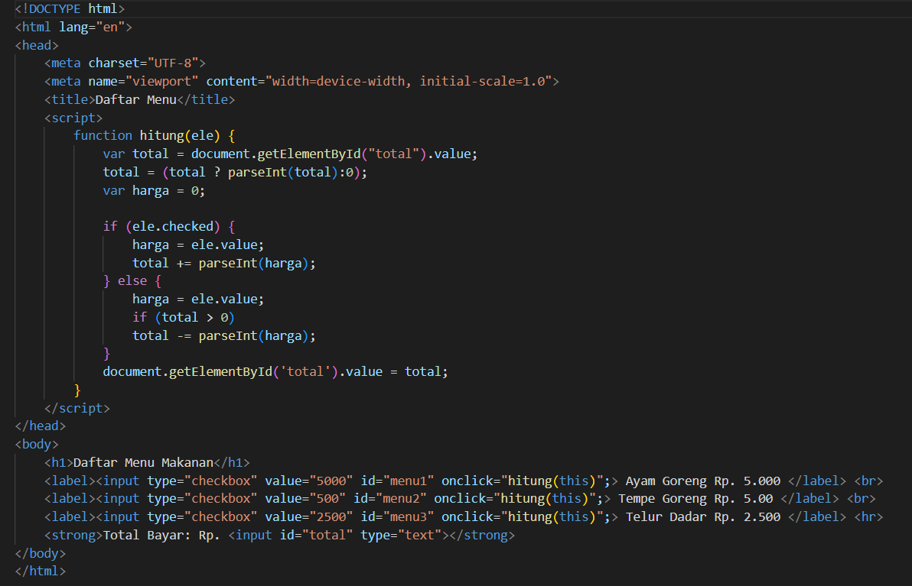
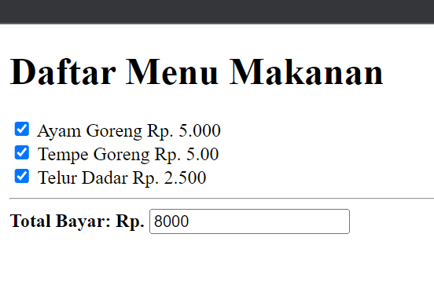

### pertanyaan dan tugas
1. validasi pada isian form
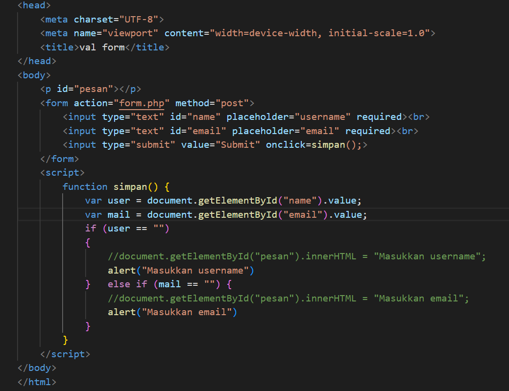
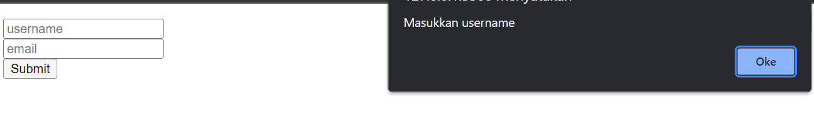