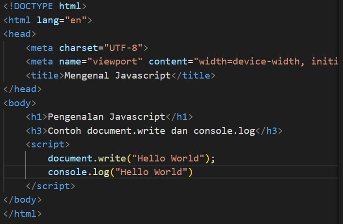
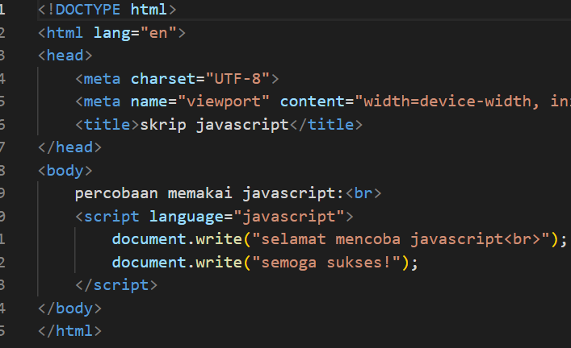
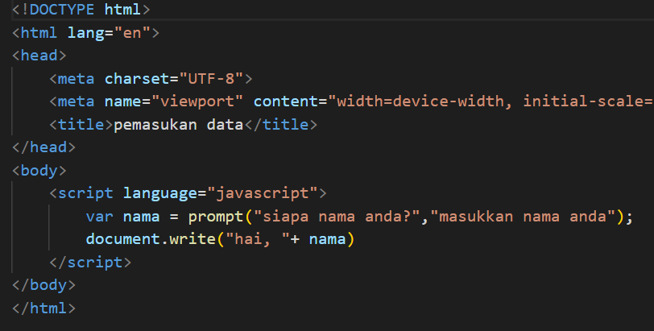
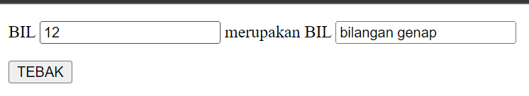

# Persiapan
membuat lab5_javascript.html

### Javascript  dasar
1. pemakaian alert sebagai properti window

2. pemakaian method dalam objek

3. prompt

4. fungsi

### dasar pemrograman di javascript
1. aritmatika

2. if else

3. switch

- jika diisi

- jika tidak diisi

### Pembuataan form
1. form input

2. form button

- klik latar belakang hijau

- klik latar belakang putih

- klik teks kuning

- klik teks biru

### HTML DOM
1. menggunakan checkbox

### pertanyaan dan tugas
1. validasi pada isian form

